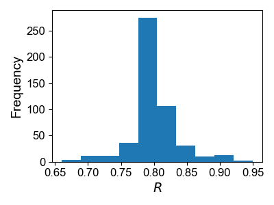
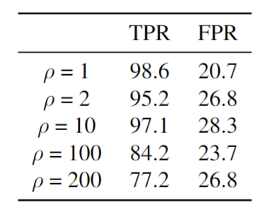
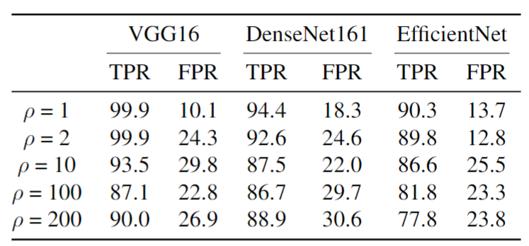

Figure 2: Distribution of Lower Bound $R_{\sigma,t}$ Values from 500 Simulations Using Algorithm 2.

Table 5: Performance of RPP against Badnets backdoor attack (2 x 2 pixel) was evaluated on the balanced CIFAR10 training dataset $(\rho = 1)$ and imbalanced CIFAR10 training datasets $(\rho = 2, 10, 100, 200)$ with  $n$ = 100, $\alpha = 0.05$ and $\sigma = 1.5$.

Table 6: Performance of RPP against Badnets backdoor attack was evaluated on the balanced CIFAR10 training dataset $(\rho = 1)$ and the imbalanced CIFAR10 training datasets $(\rho = 2, 10, 100, 200)$ under VGG16, DenseNet161, and EfficientNet model architectures with n = 100, $\alpha = 0.05$ and $\sigma = 1.5$.
